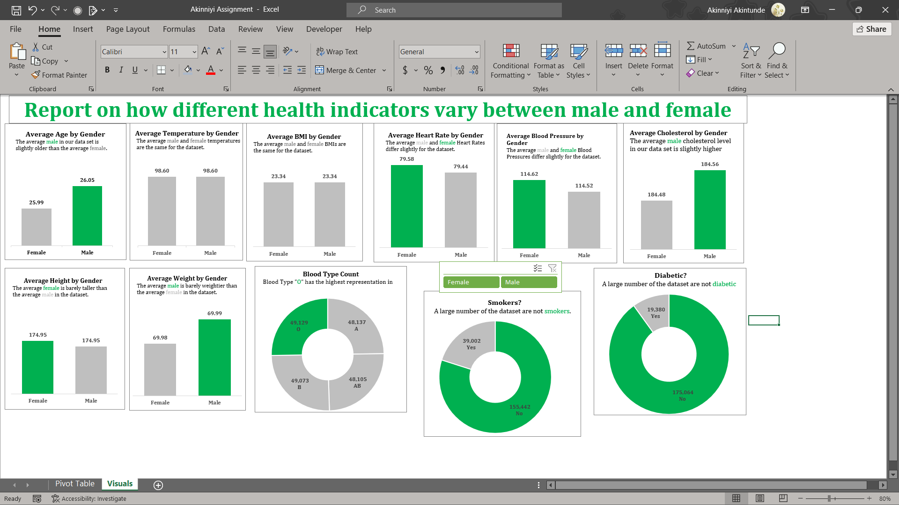

# Excel Medical Dataset 🏥

## About the data

We are working with the medical record of students which includes their _age_, _gender_, _weight_, _height_, _BMI_, _Blood type_, _Temperature_, _Heart Rate_, _Blood Pressure_ and _Diabetis_, _Cholesterol_ and _smoking_ records.

---
## Data Cleaning
The dataset needs cleaning as there are a lot of empty cells in the dataset.

I moved our data to PowerQuery where I cleaned it.
- For the _student ID_ column, because the values are unique and in order, I created an _index column_ and replaced the _student ID_ column with it.
- For the _age_, _gender_, _Blood type_, _Temperature_, _eart Rate_, _Blood Pressure_ and _Diabetis_, _Cholesterol_ and _smoking_ columns, I simply **filled up** and **filled down** the values randomly.
- For the _weight_, _height_ and _BMI_ columns, I created a _custom column_ to calculate the _BMI_ using the formula `([Weight]/([Height]*[Height]))*10000`. I then used _conditional column_ to merge the original _BMI_ column and the _custom column_ into one so as to fill the missing cells.
- I repeated the process for the _weight_ column using the formula `([BMI F]*[Height]*[Height])/10000` and the _height_ column using the formula `Number.Sqrt([Weight F]/[BMI F])*100`.
- I moved the clean data out of PowerQuery to the spreadsheet for analysis.

---
## Analysis

I created pivot tables to find the:
- Average values for the following for Males and Females (Age, BMI, Temperature, Heart Rate, Blood Pressure, and Cholesterol)
- Average Height and Weight for both Genders (in 2 decimal places)
- Number of students across the different Blood Groups
- Number of Students who smoke and those who don’t
- Number of Students who have diabetes and those who don’t

## Visualisation

From the pivot table, we created the following visuals

## Conclusion

From the results, we can see how the two genders perform against each other on the different 
